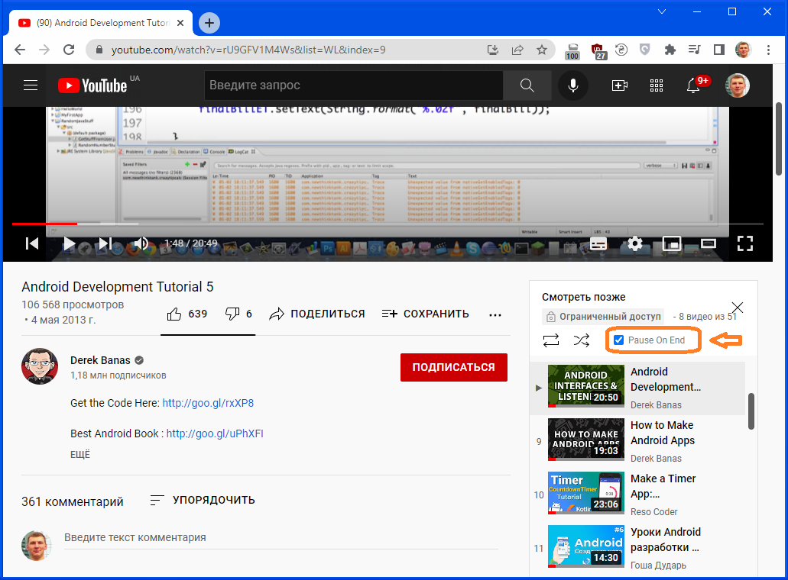

# PauseOnEnd
PauseOnEnd Chrome Extension for YouTube - Pauses the video on its last second

Adds an option (checkbox) to the playlist controls that prevents switching to the next video after the end of the current one, but pauses it at the last second.

This is necessary, for example, to read the comments on the video, otherwise you have to switch to the previous video manually each time.

v1.7    Added setting whether pause is enabled by default. The setting is in the context menu.

# 

Добавляет опцию (галочку) к элементам управления плейлиста, которая не даёт переключиться на следующее видео после окончания текущего, а ставит его на паузу на последней секунде.

Это нужно, например, чтобы прочитать комментарии к видео, иначе приходится каждый раз переключаться на предыдущее видео вручную.

v1.7    Добавлена настройка, включена ли пауза по умолчанию. Настройка находится в контекстном меню. 